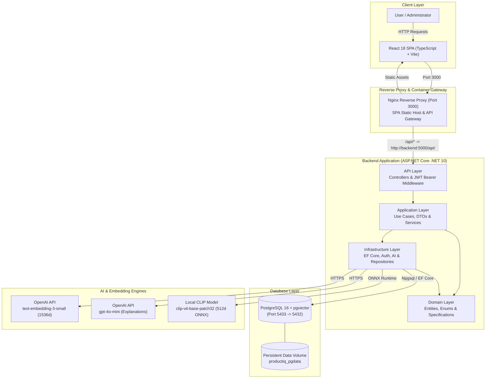
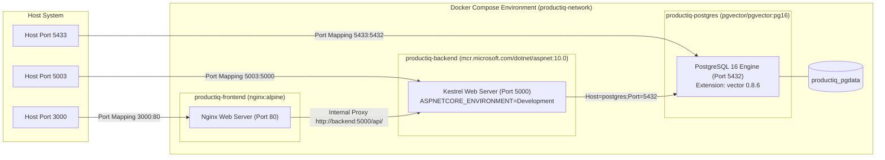
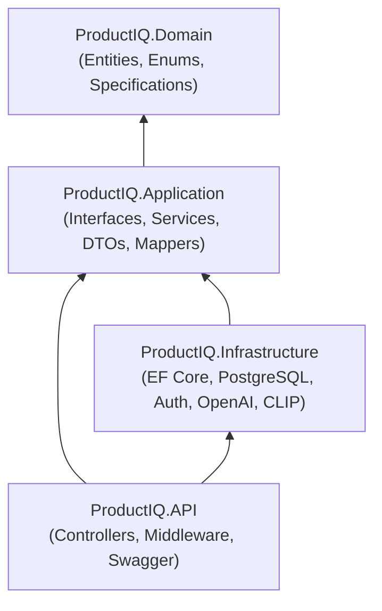
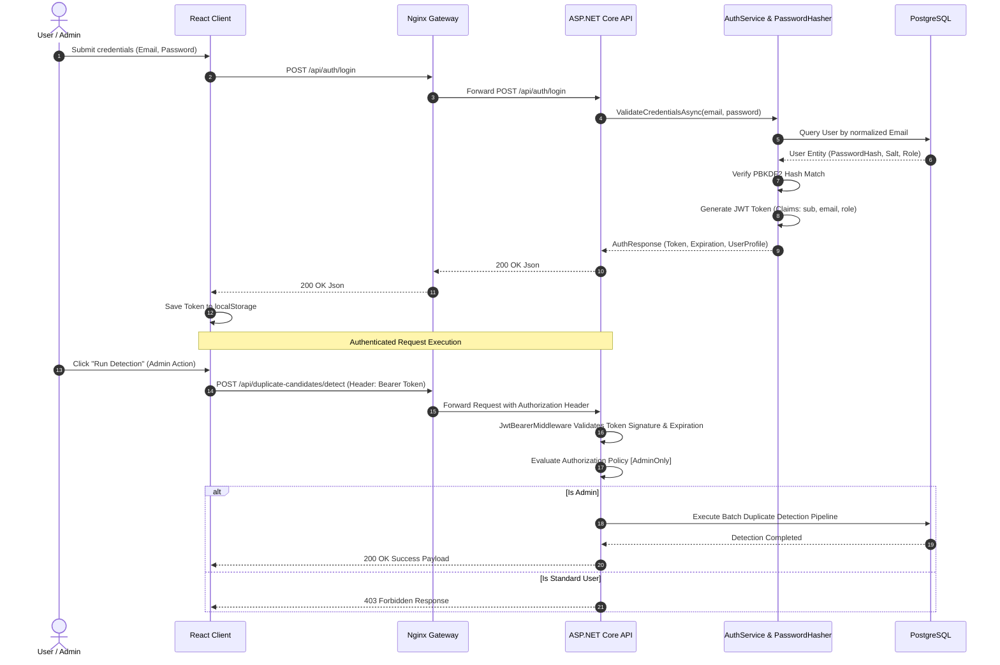
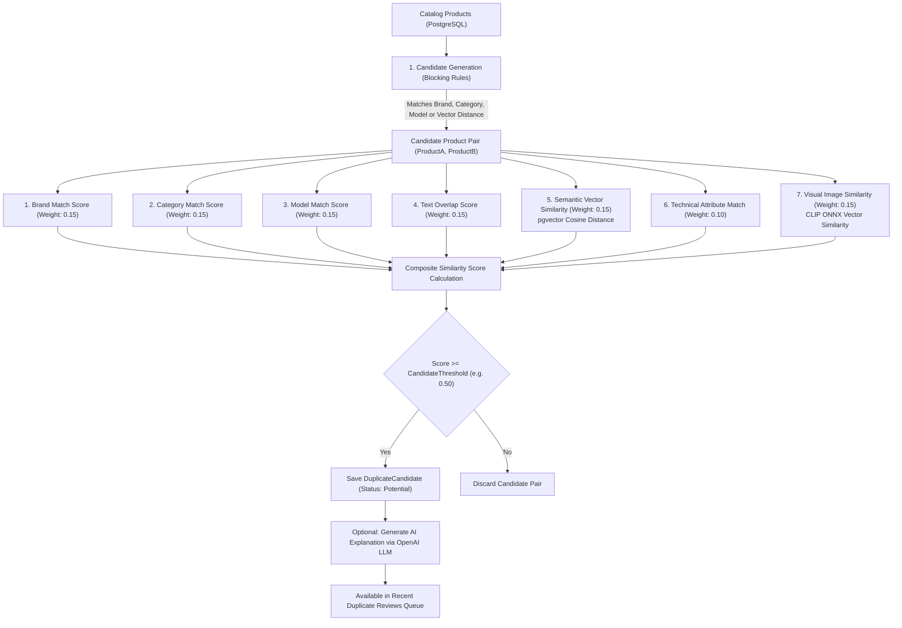
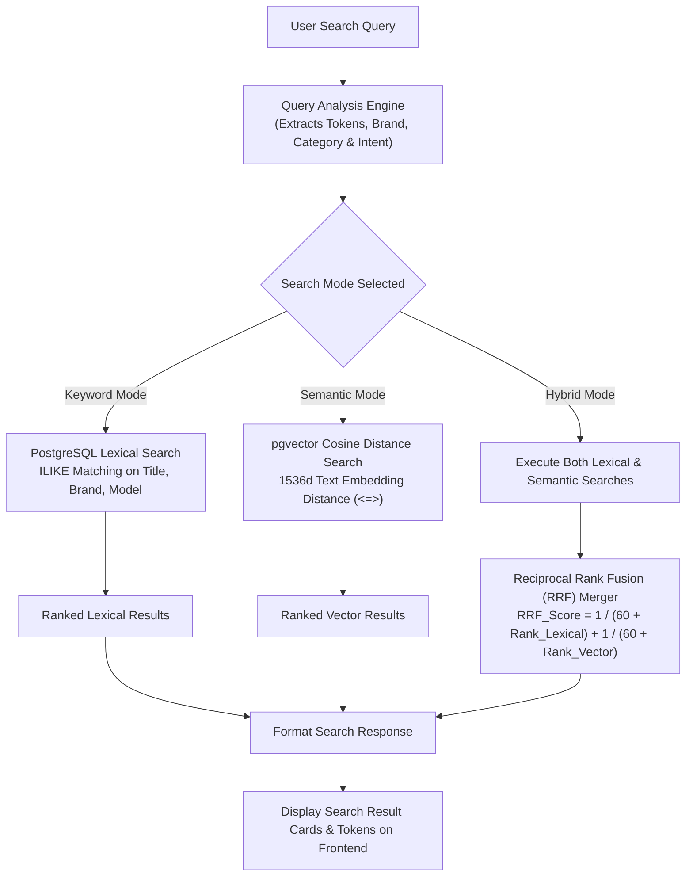
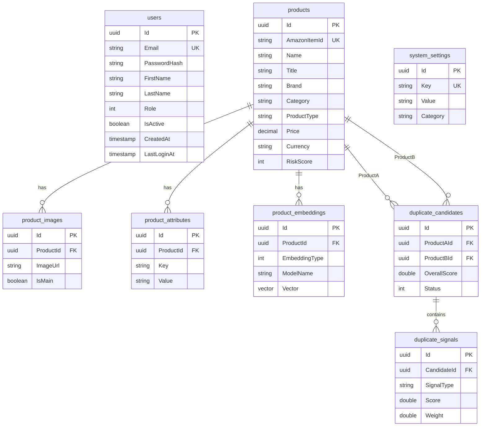

# ProductIQ Architecture Documentation

## 1. Executive Summary & System Overview

ProductIQ is an enterprise-grade Product Intelligence, Duplicate Detection, Risk Assessment, and Hybrid Search platform built using **Clean Architecture** principles on **ASP.NET Core 10 (.NET 10)**, **React 18 + TypeScript + Vite**, and **PostgreSQL 16 with pgvector**.

The platform processes large-scale product catalogs (e.g. Amazon Berkeley Objects dataset), computes 7-signal duplicate similarity scores, detects catalog risk anomalies, executes vector-based semantic and hybrid search queries, and provides AI-driven natural language explanations.

---

## 2. High-Level Architecture Diagram

---

## 3. Container & Deployment Architecture (Docker Compose)

The entire ProductIQ platform is containerized and orchestrated via **Docker Compose** on an isolated bridge network (`productiq-network`).

---

## 4. Clean Architecture Layer Breakdown

ProductIQ strictly separates business logic, application orchestration, external integrations, and delivery endpoints using Clean Architecture.

### A. Domain Layer (`ProductIQ.Domain`)
Contains core business entities and value objects without any external framework dependencies.
* **Entities**:
  - `Product`: Core entity storing normalized title, brand, category, model name, model number, price, currency, main image URL, and specifications.
  - `ProductImage`: Associated product images and thumbnail URLs.
  - `ProductAttribute`: Key-value technical specifications (e.g. Color, Connectivity, DPI).
  - `ProductEmbedding`: Stores 1536-dimensional text vector (`text-embedding-3-small`) or 512-dimensional visual vector (`clip-vit-base-patch32`) as `pgvector` data types.
  - `DuplicateCandidate`: Candidate duplicate pair (`ProductA`, `ProductB`) with confidence score, 7-signal breakdown, and status (`Potential`, `Confirmed`, `Rejected`).
  - `DuplicateSignal`: Individual signal breakdown (Brand, Category, Model, Text, Semantic, Attribute, Image).
  - `User`: Platform user entity with PBKDF2 password hash, role (`Admin` / `User`), and active state.
  - `SystemSetting`: Runtime configuration key-values (Candidate Threshold, Auto-Merge Threshold, OpenAI features).
* **Enums**: `UserRole`, `CandidateStatus`, `EmbeddingType`, `SearchMode`.

### B. Application Layer (`ProductIQ.Application`)
Defines business use-cases, DTO contracts, mapping profiles, and service interfaces.
* **Interfaces**: `IProductIQDbContext`, `IAuthService`, `ISimilaritySearchService`, `ISearchService`, `IAnalyticsService`, `ISettingsService`, `IPasswordHasher`, `IJwtTokenGenerator`, `IEmbeddingService`, `IClipImageEmbeddingService`, `IExplanationLlmService`.
* **Services**: `ProductService`, `DuplicateScoringService`, `RiskDetectionService`, `SearchService`, `AnalyticsService`, `SettingsService`.

### C. Infrastructure Layer (`ProductIQ.Infrastructure`)
Implements data persistence, external AI integrations, authentication services, and database seeders.
* **Database Context**: `ProductIQDbContext` configured with Npgsql and `UseVector()`.
* **Authentication**: `PasswordHasher` (PBKDF2 with salt) and `JwtTokenGenerator` (Symmetric HMAC-SHA256).
* **AI Integrations**:
  - `OpenAiEmbeddingService`: HTTP client for OpenAI 1536d text embeddings.
  - `ClipImageEmbeddingService`: Local ONNX Runtime inference for 512d visual embeddings.
  - `OpenAiExplanationLlmService`: LLM rationale generator for duplicate and risk analyses.
* **Database Seeder**: `UserSeeder` seeds default `admin@productiq.internal` and `user@productiq.internal` accounts on application startup.

### D. API Layer (`ProductIQ.API`)
HTTP REST controllers, OpenAPI/Swagger specifications, and global middleware.
* **Controllers**: `AuthController`, `ProductsController`, `DuplicateCandidatesController`, `RiskController`, `SearchController`, `AnalyticsController`, `SettingsController`.
* **Middleware**: `GlobalExceptionHandler` returning RFC 7807 `ProblemDetails`, JWT Bearer Authentication, and CORS policies.

---

## 5. Authentication & Authorization Sequence Flow

ProductIQ implements stateless JWT (JSON Web Token) authentication paired with Role-Based Access Control (RBAC).

---

## 6. Duplicate Detection 7-Signal Scoring Pipeline

Duplicate Detection executes a 3-tier analysis pipeline to identify potential catalog duplicates with high precision.

---

## 7. Search Architecture (Keyword, Semantic & Hybrid Modes)

The Search Playground supports 3 distinct search strategies using lexical matching, vector cosine distance, and Reciprocal Rank Fusion (RRF).

---

## 8. Database Schema Overview (PostgreSQL + pgvector)

---

## 9. Verification & Quality Matrix

ProductIQ maintains comprehensive test coverage across unit, integration, benchmark evaluation, and frontend end-to-end layers:

| Layer | Project / Suite | Test Count | Pass Rate | Scope |
|:---|:---|:---:|:---:|:---|
| **Backend Unit Tests** | `ProductIQ.UnitTests` | 76 | %100 | Domain entities, auth services, scoring logic, search analysis |
| **Backend Integration Tests** | `ProductIQ.IntegrationTests` | 92 | %100 | Real PostgreSQL + pgvector, full HTTP pipeline, JWT auth, RBAC policies |
| **ABO Benchmark Evaluation** | `Ground Truth Suite` | 500 pairs | %100 Recall | ABO catalog evaluation set (Recall: 100%, Precision: 99.31% at threshold 0.50) |
| **Frontend Tests** | `Vitest + Testing Library` | 71 | %100 | AuthContext, ProtectedRoute, RBAC UI, components, end-to-end user flows |
| **TOTAL** | | **239 tests (+500 pairs)** | **%100** | **Clean build, 0 errors, 0 regressions** |